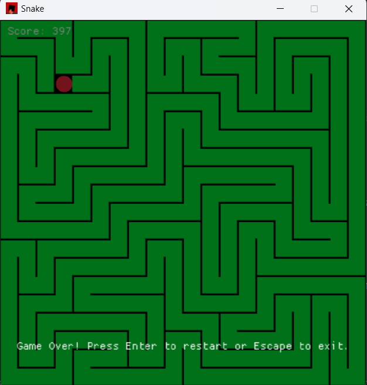

# Hamiltonian Snake

A Snake game implementation in Rust using the macroquad framework with an AI bot using a Hamiltonian cycle algorithm for efficient path-finding.



## Features

- Classic Snake gameplay with modern controls
- Hamiltonian cycle algorithm implementation for the snake's AI movement
- Adjustable game speed (0.5x to 100x)
- Option to visualize the Hamiltonian cycle path
- Score tracking
- Clean, responsive UI with controls panel
- Game over screen with restart option

## How It Works

This Snake implementation uses a Hamiltonian cycle algorithm to determine the snake's movement path. A Hamiltonian cycle is a path that visits every cell in the grid exactly once before returning to the starting point. This ensures the snake can theoretically grow to fill the entire grid without colliding with itself.

### Key Components:

1. **Game Logic**: Manages the overall game state, including score, apple spawning, and game over conditions.
2. **Snake Movement**: Handles the snake's position, growth, and collision detection.
3. **Hamiltonian Cycle**: Generates a path that covers the entire grid exactly once, allowing the snake to navigate safely.
4. **UI Controls**: Provides options to adjust game speed and toggle cycle path visualization.

## Controls

- **Game Speed Slider**: Adjust the snake's movement speed from 0.5x to 100x
- **Show Cycle Checkbox**: Toggle the visibility of the Hamiltonian cycle path
- After game over:
  - **Enter**: Restart the game
  - **Escape**: Exit the game

## Requirements

- Rust 1.65 or later
- Cargo package manager

## Installation

1. Clone the repository:

   ```bash
   git clone https://github.com/Abots-jzm/snake.git
   cd snake
   ```

2. Build and run the game:
   ```bash
   cargo run --release
   ```

## Technical Details

The game is built with:

- **Rust**: A systems programming language focused on safety, speed, and concurrency
- **macroquad**: A cross-platform game framework for Rust
- **Hamiltonian Cycle Algorithm**: Ensures the snake can theoretically fill the entire grid

The game window is set to 500x500 pixels with a cell size of 25 pixels, creating a 20x20 grid.

## Project Structure

- `main.rs`: Entry point that sets up the game window and main loop
- `game.rs`: Core game logic, UI, and state management
- `snake.rs`: Snake movement, growth, and rendering logic
- `bot.rs`: Implementation of the Hamiltonian cycle algorithm

## License

This project is licensed under the MIT License - see the LICENSE file for details.

## Acknowledgments

- Inspired by classic Snake games
- Built with [macroquad](https://github.com/not-fl3/macroquad)
